<!-- author: uncletientrung -->
- [Giới thiệu đề tài](#đề-tài-hệ-thống-quản-lý-tuyển-sinh)
- [Thành viên & Đóng góp](#thành-viên--đóng-góp)
- [Công nghệ sử dụng](#công-nghệ-sử-dụng)
- [Cài đặt & Chạy chương trình](#getting-started)
- [Tài khoản sử dụng](#tài-khoản-admin)
- [Giao diện hệ thống](#giao-diện)

# Đồ án môn mô hình phân lớp 
## Đề tài: Hệ thống quản lý tuyển sinh

## Thành viên & Đóng góp
| Thành viên | MSSV | Vai trò |
|----|------|--------|
|  Nguyễn Tiến Trung | 3123410396 | Nhóm trưởng |
|  Nguyễn Minh Thuận | 3123410365 | Thành viên |
|  Trương Minh Vũ | 3123410437 | Thành viên |
|  Nguyễn Phạm Tuấn Khôi | 3123410174 | Thành viên |
|  Hàn Gia Hào | 3122410100 | Thành viên |

## Công nghệ sử dụng
### Desktop Application
- Java Swing
- Java AWT

### Backend
- Java
- Spring Boot
- Spring MVC
- Spring Data JPA
- Hibernate ORM

### Web Application
- Thymeleaf
- HTML/CSS
- JavaScript
- Bootstrap

### Database
- MySQL

### Build Tool & Development
- Git/GitHub
- XAMPP, Netbeans

## Getting Started
1. Yêu cầu môi trường
    - Java 17 hoặc cao hơn
    - XAMPP
    - Netbeans
2. Tải source code về:
    ```bash
   git clone https://github.com/uncletientrung/QuanLyTuyenSinh.git
   ```
3. Mở xampp và vào trang http://localhost/phpmyadmin/ tạo 1 database mới có tên là xettuyen2026_empty và import cơ sở dữ liệu trong folder database -> file xettuyen2026_empty.sql trong project.

## Tài khoản sử dụng
- Username: admin
- Password: 123

## Giao diện
<h4 align="center">Trang chủ</h4>
<table align="center" border="5" cellpadding="10" cellspacing="0">
  <tr>
    <td>
      
    </td>
  </tr>
</table>

<h4 align="center">Quản lý thí sinh</h4>
<table align="center" border="5" cellpadding="10" cellspacing="0">
  <tr>
    <td>
      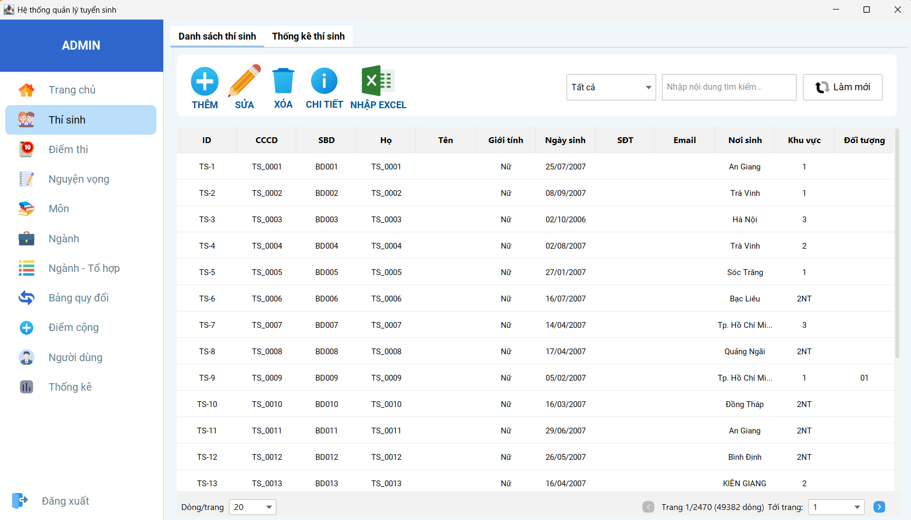
    </td>
  </tr>
</table>

<h4 align="center">Thống kê thí sinh</h4>
<table align="center" border="5" cellpadding="10" cellspacing="0">
  <tr>
    <td>
      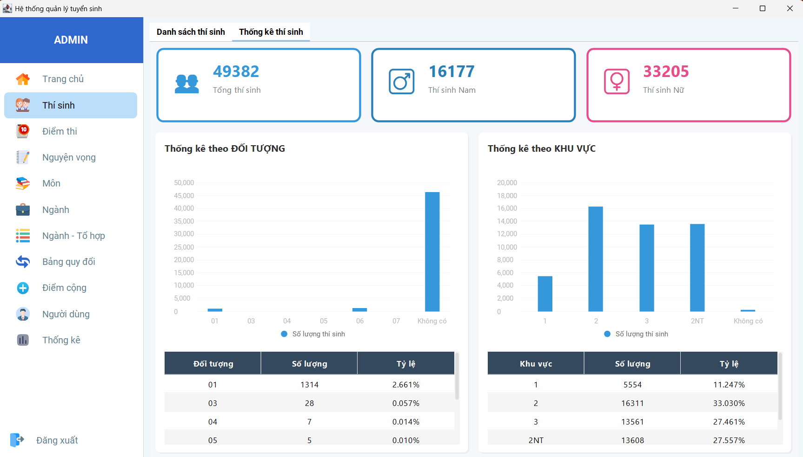
    </td>
  </tr>
</table>

<h4 align="center">Quản lý điểm thi (THPT / VSAT / DGNL)</h4>
<table align="center" border="5" cellpadding="10" cellspacing="0">
  <tr>
    <td>
      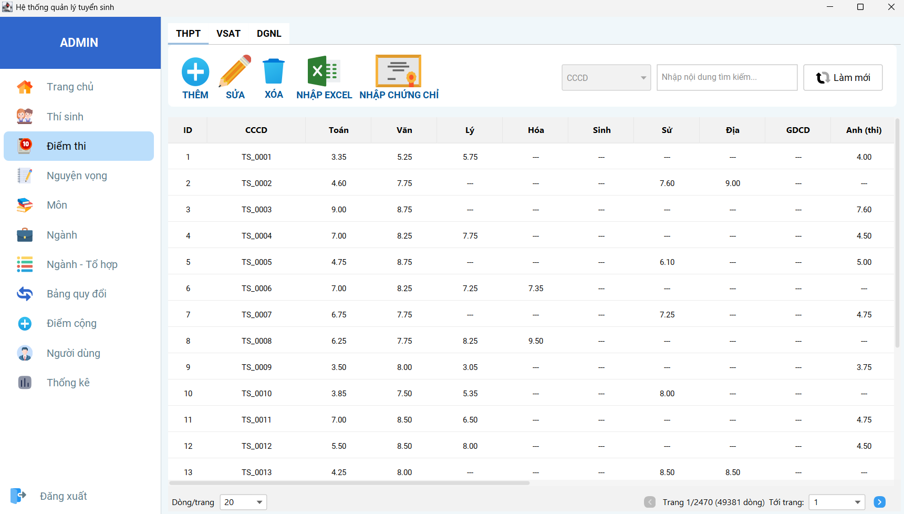
    </td>
  </tr>
</table>

<h4 align="center">Quản lý nguyện vọng</h4>
<table align="center" border="5" cellpadding="10" cellspacing="0">
  <tr>
    <td>
      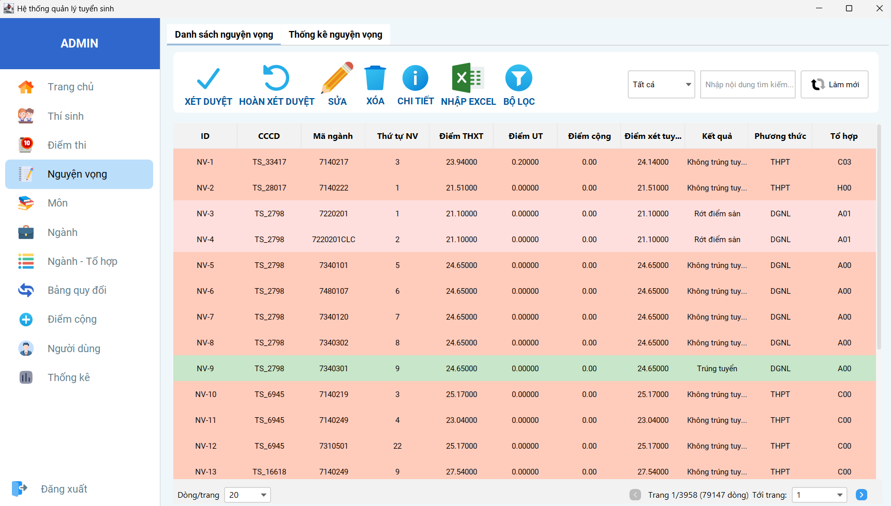
    </td>
  </tr>
</table>

<h4 align="center">Thống kê nguyện vọng</h4>
<table align="center" border="5" cellpadding="10" cellspacing="0">
  <tr>
    <td>
      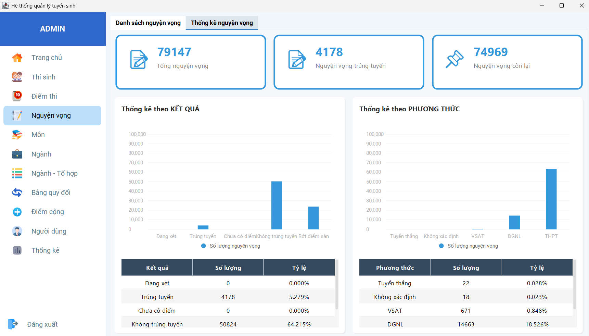
    </td>
  </tr>
</table>

<h4 align="center">Quản lý môn</h4>
<table align="center" border="5" cellpadding="10" cellspacing="0">
  <tr>
    <td>
      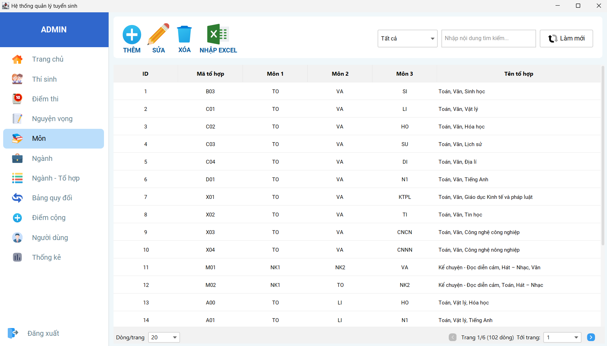
    </td>
  </tr>
</table>

<h4 align="center">Quản lý ngành</h4>
<table align="center" border="5" cellpadding="10" cellspacing="0">
  <tr>
    <td>
      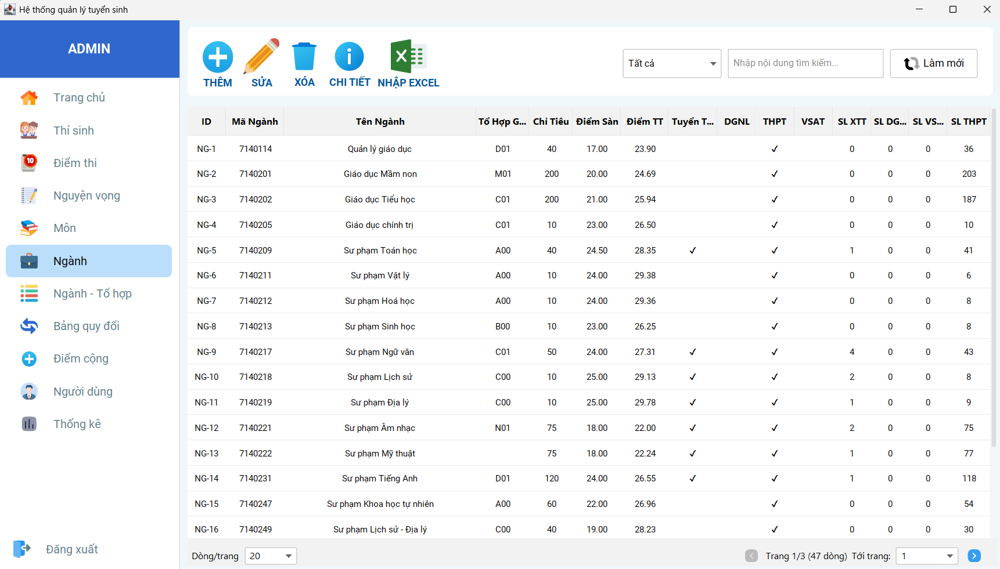
    </td>
  </tr>
</table>

<h4 align="center">Quản lý ngành - tổ hợp</h4>
<table align="center" border="5" cellpadding="10" cellspacing="0">
  <tr>
    <td>
      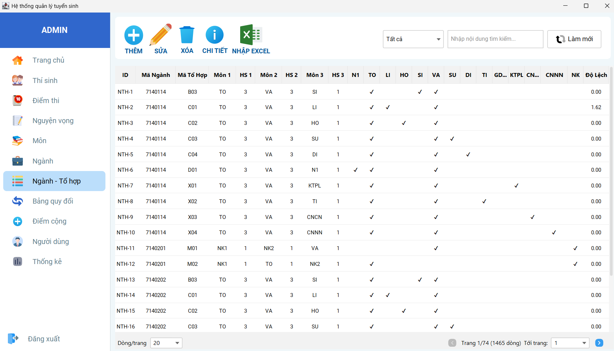
    </td>
  </tr>
</table>

<h4 align="center">Quản lý bảng quy đổi</h4>
<table align="center" border="5" cellpadding="10" cellspacing="0">
  <tr>
    <td>
      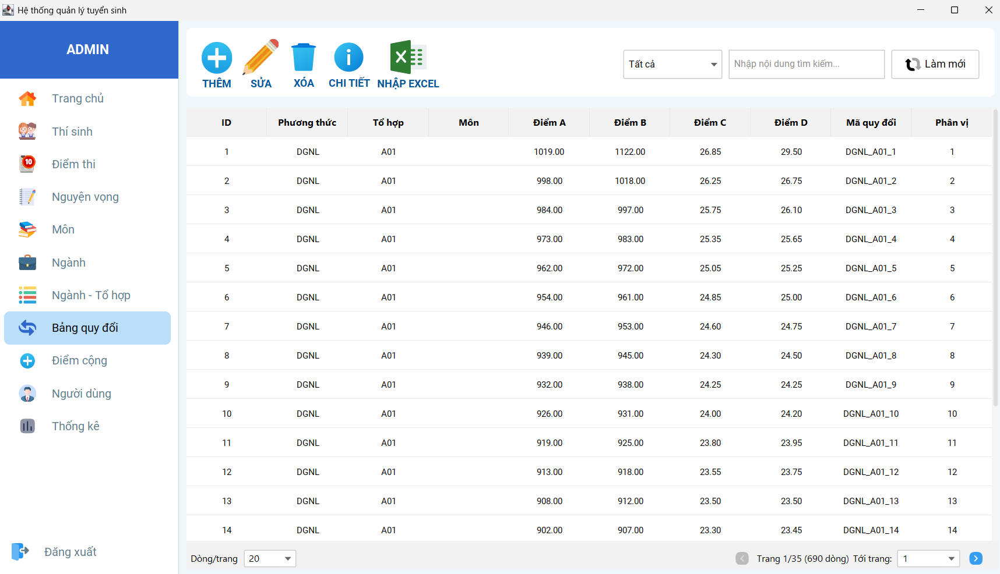
    </td>
  </tr>
</table>

<h4 align="center">Quản lý điểm cộng</h4>
<table align="center" border="5" cellpadding="10" cellspacing="0">
  <tr>
    <td>
      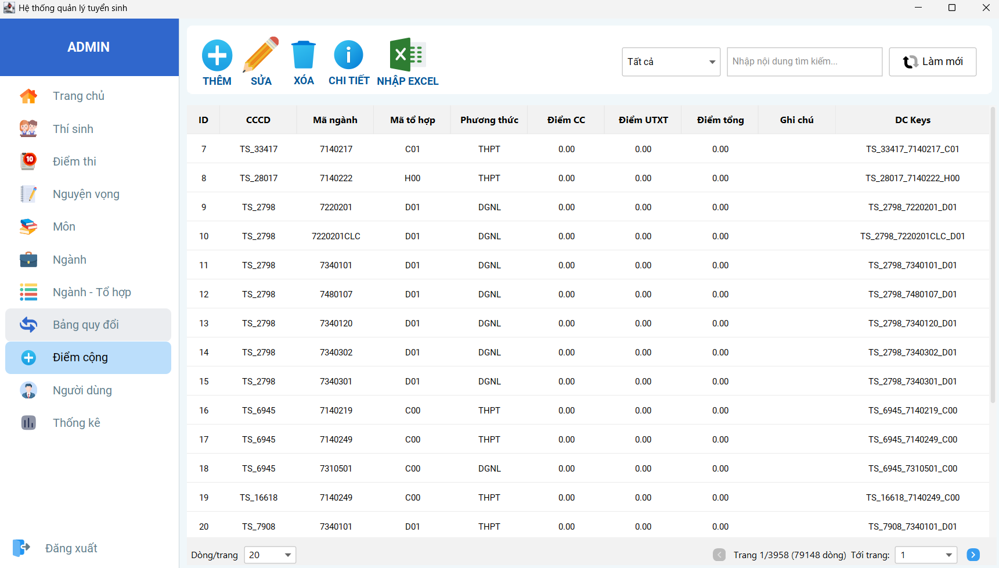
    </td>
  </tr>
</table>

<h4 align="center">Thông kê điểm thi</h4>
<table align="center" border="5" cellpadding="10" cellspacing="0">
  <tr>
    <td>
      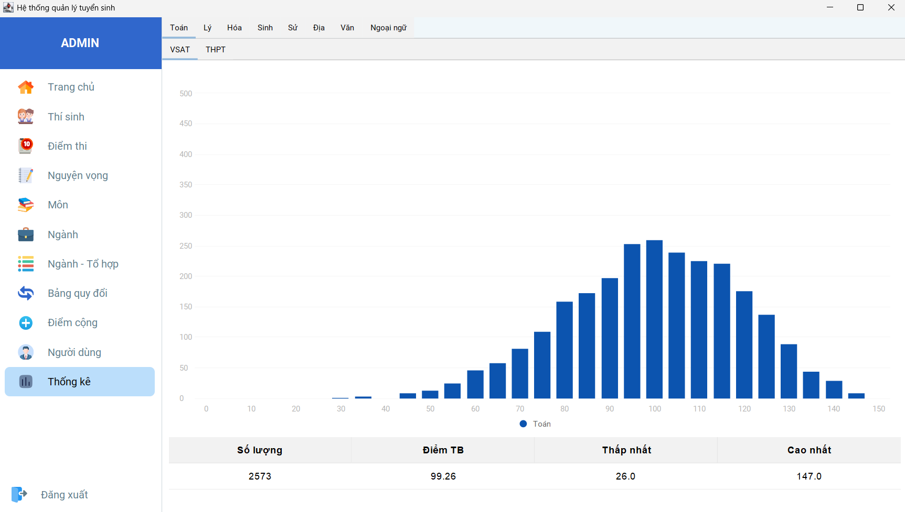
    </td>
  </tr>
</table>